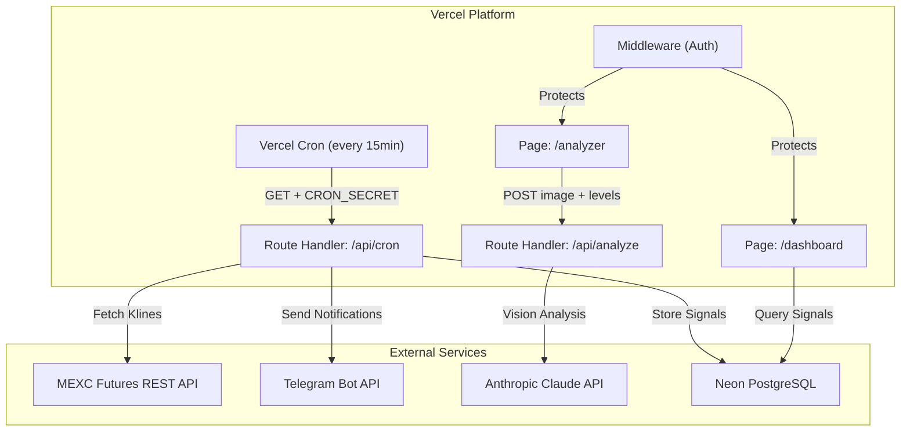

# Design Document: MEXC Trading Scanner

## Overview

The MEXC Trading Scanner is a Next.js 14+ App Router application deployed on Vercel that provides automated futures trading signal generation and manual chart analysis. The system operates in two modes:

1. **Automated Scanner** — A cron-triggered pipeline that fetches candlestick data from the MEXC Futures API, detects candlestick patterns, scores signals using technical indicator confluence, calculates trade levels (entry/TP/SL), persists signals to a PostgreSQL database (Neon), and delivers top signals via Telegram.

2. **Manual Analyzer** — A page where users upload chart screenshots with proposed trade levels and receive structured AI-powered analysis from a vision-capable Claude model.

The application is protected by a simple shared-secret authentication mechanism suitable for single-user personal deployment.

### Key Design Decisions

- **Next.js App Router with Route Handlers** for the cron endpoint and API routes, Server Components for dashboard rendering
- **Drizzle ORM + Neon PostgreSQL** for type-safe database access with serverless-compatible connection pooling
- **Sequential symbol processing** within a single cron invocation to stay within Vercel's 60-second function limit
- **Stateless architecture** — all state lives in the database; each cron run is independent
- **Configuration via environment variables** with validated defaults, no admin UI for config changes

---

## Architecture

### System Architecture Diagram



### Scanner Pipeline Flow

```mermaid
flowchart LR
    A[Load Config] --> B[Fetch Watchlist]
    B --> C[Fetch Klines per Symbol]
    C --> D[Detect Patterns]
    D --> E[Calculate Indicators]
    E --> F[Compute Score]
    F --> G[Rank & Select Top N]
    G --> H[Calculate Trade Levels]
    H --> I[Deduplicate]
    I --> J[Persist to DB]
    J --> K[Send to Telegram]
```



### Request Flow for Cron Execution

1. Vercel Cron fires a GET request to `/api/cron` with `Authorization: Bearer <CRON_SECRET>`
2. Route handler validates the secret, returns 401 if invalid
3. Scanner loads configuration and watchlist
4. For each symbol: fetch klines → detect patterns → compute indicators
5. Score all symbols, rank, select top N above threshold
6. For each selected signal: calculate trade levels → check deduplication → persist → send Telegram
7. Return 200 with signal count

---

## Components and Interfaces

### 1. Cron Handler (`/api/cron/route.ts`)

**Responsibility:** Validates cron secret, orchestrates the scanner pipeline, handles errors.

```typescript
interface CronResponse {
  success: boolean;
  signalsGenerated: number;
  errors?: string[];
}
```

### 2. Configuration Module (`lib/config.ts`)

**Responsibility:** Loads, validates, and provides typed configuration from environment variables.

```typescript
interface ScannerConfig {
  watchlist: string[];              // max 50 symbols
  candleInterval: '5m' | '15m' | '30m';
  rollingWindowHours: number;       // default 3
  minScoreThreshold: number;        // 0-100, default 50
  topNSignals: number;              // 1-50, default 5
  atrMultiplier: number;            // 0.5-5.0, default 1.5
  riskRewardRatio: '1:1.5' | '1:2' | '1:3';
  dedupeWindowHours: number;        // 1-24, default 4
  emaPeriod: number;                // default 20
  rsiPeriod: number;                // default 14
  atrPeriod: number;                // default 14
  volumeSpikeMultiplier: number;    // default 1.5
  rsiOversold: number;              // default 40
  rsiOverbought: number;            // default 60
}

function loadConfig(): ScannerConfig;
```

### 3. Market Data Service (`lib/market-data.ts`)

**Responsibility:** Fetches kline data from the MEXC Futures REST API.

```typescript
interface Kline {
  timestamp: number;
  open: number;
  high: number;
  low: number;
  close: number;
  volume: number;
}

interface MarketDataService {
  fetchKlines(symbol: string, interval: string, limit: number): Promise<Kline[] | null>;
}
```

- Base URL: `https://contract.mexc.com/api/v1/contract/kline/{symbol}`
- Parameters: `interval` (Min5, Min15, Min30), `start`/`end` timestamps
- Timeout: 10 seconds per request
- Returns `null` on error (timeout, HTTP error, insufficient data)

### 4. Pattern Detection Engine (`lib/patterns.ts`)

**Responsibility:** Analyzes kline arrays and detects candlestick patterns using deterministic rules.

```typescript
type PatternDirection = 'bullish' | 'bearish';

interface DetectedPattern {
  name: string;
  direction: PatternDirection;
  strength: number;       // 0-1
  timestamp: number;      // kline timestamp where pattern completed
}

interface PatternDetector {
  detect(klines: Kline[]): DetectedPattern[];
}
```

Supported patterns with minimum candle requirements:
| Pattern | Min Candles | Direction |
|---------|-------------|-----------|
| Bullish Engulfing | 2 | bullish |
| Bearish Engulfing | 2 | bearish |
| Hammer | 1 | bullish |
| Inverted Hammer | 1 | bullish |
| Shooting Star | 1 | bearish |
| Doji | 1 | neutral→context |
| Morning Star | 3 | bullish |
| Evening Star | 3 | bearish |
| Three White Soldiers | 3 | bullish |
| Three Black Crows | 3 | bearish |
| Piercing Line | 2 | bullish |
| Dark Cloud Cover | 2 | bearish |

### 5. Technical Indicators Module (`lib/indicators.ts`)

**Responsibility:** Computes EMA, RSI, ATR, and volume analysis from kline data.

```typescript
interface IndicatorResults {
  ema: number;
  rsi: number;
  atr: number;
  volumeSpike: boolean;
  atrPercentile: number;  // 0-1, position of current ATR in rolling window
}

function calculateIndicators(klines: Kline[], config: ScannerConfig): IndicatorResults;
function calculateEMA(closes: number[], period: number): number;
function calculateRSI(closes: number[], period: number): number;
function calculateATR(klines: Kline[], period: number): number;
```

### 6. Scoring Engine (`lib/scoring.ts`)

**Responsibility:** Computes Signal_Score from patterns and indicators using weighted sum.

```typescript
interface ScoringWeights {
  pattern: number;       // default 30
  emaTrend: number;      // default 25
  rsiCondition: number;  // default 20
  volumeSpike: number;   // default 15
  atrCondition: number;  // default 10
}

interface ScoredSymbol {
  symbol: string;
  direction: PatternDirection;
  patterns: DetectedPattern[];
  indicators: IndicatorResults;
  score: number;           // 0-100
  latestPatternTimestamp: number;
}

function computeScore(
  patterns: DetectedPattern[],
  indicators: IndicatorResults,
  direction: PatternDirection,
  config: ScannerConfig,
  weights?: ScoringWeights
): number;
```

Score computation:
- **Pattern** (0-30): Sum of pattern strengths, capped at 30
- **EMA trend** (0-25): Full points if price aligns with signal direction
- **RSI** (0-20): Full points if RSI in favorable zone
- **Volume spike** (0-15): Full points if volume exceeds threshold
- **ATR** (0-10): Full points if ATR within normal volatility range (25th-75th percentile)

### 7. Trade Level Calculator (`lib/trade-levels.ts`)

**Responsibility:** Computes entry, stop-loss, and take-profit levels.

```typescript
interface TradeLevels {
  entry: number;
  stopLoss: number;
  takeProfit: number;
  direction: 'long' | 'short';
  riskRewardRatio: string;
}

function calculateTradeLevels(
  klines: Kline[],
  direction: PatternDirection,
  patterns: DetectedPattern[],
  atr: number,
  config: ScannerConfig
): TradeLevels | null;  // null if SL equals entry
```

Logic:
- **Entry**: Current close for breakout patterns; 50% retracement of last 20-candle swing for pullback patterns
- **Stop-loss**: Wider of (swing high/low from last 20 candles) or (entry ± 1.5×ATR)
- **Take-profit**: Entry ± (|entry - SL| × R:R ratio) in signal direction
- Returns `null` if stop-loss equals entry (zero distance)

### 8. Signal Repository (`lib/db/signals.ts`)

**Responsibility:** Signal persistence and querying via Drizzle ORM.

```typescript
interface SignalRecord {
  id: string;
  symbol: string;
  direction: 'long' | 'short';
  entryPrice: number;
  takeProfit: number;
  stopLoss: number;
  patterns: string[];        // pattern names
  score: number;
  timestamp: Date;
  suppressed: boolean;
  cronInterval: string;      // ISO timestamp of cron interval for idempotency
  createdAt: Date;
}

interface SignalRepository {
  findDuplicates(symbol: string, direction: string, windowHours: number): Promise<SignalRecord[]>;
  findByCronInterval(interval: string): Promise<SignalRecord[]>;
  insert(signal: Omit<SignalRecord, 'id' | 'createdAt'>): Promise<SignalRecord>;
  queryForDashboard(filters: DashboardFilters): Promise<PaginatedResult<SignalRecord>>;
}
```

### 9. Telegram Notifier (`lib/telegram.ts`)

**Responsibility:** Formats and sends signal messages to Telegram.

```typescript
interface TelegramNotifier {
  isConfigured(): boolean;
  sendSignal(signal: SignalRecord): Promise<boolean>;
}
```

- Sequential delivery with 1-second delay between messages
- 30-second timeout per message
- No retry on failure; logs and continues

### 10. Chart Analyzer (`/api/analyze/route.ts` + `/analyzer/page.tsx`)

**Responsibility:** Accepts chart image + trade levels, sends to Claude Vision, returns structured analysis.

```typescript
interface AnalysisRequest {
  image: string;          // base64-encoded
  imageType: 'image/png' | 'image/jpeg' | 'image/webp';
  entryPrice: number;
  takeProfit: number;
  stopLoss: number;
}

interface AnalysisResponse {
  patterns: string;
  trendAssessment: string;
  tradeEvaluation: string;
  summary: string;
}
```

### 11. Authentication Middleware (`middleware.ts`)

**Responsibility:** Protects dashboard and analyzer pages with shared-secret auth.

- Cookie-based session after password verification
- Login page at `/login`
- Environment variable: `APP_PASSWORD`
- Middleware checks for valid session cookie on `/dashboard` and `/analyzer` routes

---

## Data Models

### Database Schema (Drizzle ORM)

```typescript
import { pgTable, text, real, boolean, timestamp, uuid, index } from 'drizzle-orm/pg-core';

export const signals = pgTable('signals', {
  id: uuid('id').defaultRandom().primaryKey(),
  symbol: text('symbol').notNull(),
  direction: text('direction', { enum: ['long', 'short'] }).notNull(),
  entryPrice: real('entry_price').notNull(),
  takeProfit: real('take_profit').notNull(),
  stopLoss: real('stop_loss').notNull(),
  patterns: text('patterns').array().notNull(),       // array of pattern names
  score: real('score').notNull(),
  timestamp: timestamp('timestamp', { withTimezone: true }).notNull(),
  suppressed: boolean('suppressed').notNull().default(false),
  cronInterval: text('cron_interval').notNull(),      // for idempotency checks
  createdAt: timestamp('created_at', { withTimezone: true }).defaultNow().notNull(),
}, (table) => ({
  timestampIdx: index('idx_signals_timestamp').on(table.timestamp),
  symbolIdx: index('idx_signals_symbol').on(table.symbol),
  dedupeIdx: index('idx_signals_dedupe').on(table.symbol, table.direction, table.timestamp),
  cronIntervalIdx: index('idx_signals_cron_interval').on(table.cronInterval),
}));

export const sessions = pgTable('sessions', {
  id: uuid('id').defaultRandom().primaryKey(),
  token: text('token').notNull().unique(),
  expiresAt: timestamp('expires_at', { withTimezone: true }).notNull(),
  createdAt: timestamp('created_at', { withTimezone: true }).defaultNow().notNull(),
});
```

### Kline Data Model (In-Memory)

```typescript
interface Kline {
  timestamp: number;   // Unix ms
  open: number;
  high: number;
  low: number;
  close: number;
  volume: number;
}
```

### Configuration Schema

Environment variables:
| Variable | Required | Description |
|----------|----------|-------------|
| `MEXC_API_KEY` | Yes | MEXC API key |
| `MEXC_API_SECRET` | Yes | MEXC API secret |
| `TELEGRAM_BOT_TOKEN` | No | Telegram bot token |
| `TELEGRAM_CHAT_ID` | No | Telegram chat ID |
| `ANTHROPIC_API_KEY` | Yes | Anthropic API key |
| `DATABASE_URL` | Yes | Neon PostgreSQL connection string |
| `CRON_SECRET` | Yes | Secret for cron verification |
| `APP_PASSWORD` | Yes | Shared secret for UI access |
| `SCANNER_CONFIG` | No | JSON string with scanner params |

---

## Correctness Properties

*A property is a characteristic or behavior that should hold true across all valid executions of a system — essentially, a formal statement about what the system should do. Properties serve as the bridge between human-readable specifications and machine-verifiable correctness guarantees.*

### Property 1: Cron Authentication Correctness

*For any* HTTP request to the cron endpoint, the handler SHALL execute the scanner if and only if the request contains a valid CRON_SECRET in the Authorization header; all other requests SHALL receive HTTP 401.

**Validates: Requirements 1.1, 1.2, 11.3**

### Property 2: Cron Idempotency

*For any* cron interval, executing the scanner pipeline multiple times for the same interval SHALL produce no duplicate signals in the database — the set of signals for a given cronInterval value is identical regardless of how many times the handler runs for that interval.

**Validates: Requirements 1.3**

### Property 3: Error Isolation

*For any* unhandled exception during scanner execution, the cron handler SHALL return HTTP 500 and the Telegram notifier SHALL have sent zero messages for that execution — no partial signal delivery occurs.

**Validates: Requirements 1.5**

### Property 4: Kline Request Count Matches Configuration

*For any* valid scanner configuration (candle interval and rolling window duration), the number of klines requested from the MEXC API SHALL equal `ceil(rollingWindowHours * 60 / intervalMinutes)`.

**Validates: Requirements 2.2**

### Property 5: Incomplete Data Rejection

*For any* kline dataset returned by the API that has fewer records than expected for the rolling window duration, or has any record missing a required field (open, high, low, close, volume, timestamp), the scanner SHALL skip pattern analysis for that symbol.

**Validates: Requirements 2.6**

### Property 6: Pattern Detection Determinism

*For any* kline sequence, running pattern detection twice SHALL produce identical results. Each detected pattern SHALL conform to its quantifiable rules (e.g., doji body ≤ 10% of range, engulfing second body contains first body).

**Validates: Requirements 3.1, 3.4**

### Property 7: Pattern Output Validity

*For any* detected pattern, the output SHALL have: a name from the set of 12 supported patterns, a direction of "bullish" or "bearish", a strength value in [0, 1], and a timestamp matching a kline timestamp from the input.

**Validates: Requirements 3.2**

### Property 8: Minimum Candle Guard

*For any* kline array with length less than a pattern's required minimum candle count (1, 2, or 3), that pattern SHALL never appear in the detection results.

**Validates: Requirements 3.3, 3.5**

### Property 9: Technical Indicator Mathematical Correctness

*For any* valid kline series of sufficient length, the calculated EMA SHALL equal the recursive EMA formula (`price × k + prevEMA × (1-k)` where `k = 2/(period+1)`), the RSI SHALL equal `100 - 100/(1 + avgGain/avgLoss)`, and the ATR SHALL equal the smoothed average of true ranges.

**Validates: Requirements 4.1**

### Property 10: Signal Score Bounded and Deterministic

*For any* combination of detected patterns, EMA alignment, RSI value, volume spike presence, and ATR percentile, the computed Signal_Score SHALL be in [0, 100] and SHALL equal the sum of weighted component contributions.

**Validates: Requirements 4.2**

### Property 11: Pattern Score Component Capped

*For any* number of detected patterns with any individual strengths, the pattern component contribution to the total Signal_Score SHALL never exceed the maximum pattern weight (30 points).

**Validates: Requirements 4.3**

### Property 12: Signal Ranking Correctness

*For any* list of scored symbols, the selected output SHALL be: sorted by Signal_Score descending, contain at most N items, contain only items with score ≥ minimum threshold, and when two items share the same score, the one with the more recent pattern timestamp SHALL appear first.

**Validates: Requirements 4.4, 4.5, 4.6**

### Property 13: Entry Price Calculation

*For any* kline history and signal direction, the entry price SHALL equal the current candle's close price for breakout patterns, or the 50% retracement level of the most recent swing (measured over the last 20 candles) for pullback patterns.

**Validates: Requirements 5.1**

### Property 14: Stop-Loss Wider-Of Rule

*For any* kline history with identifiable swing high/low and a computed ATR value, the stop-loss SHALL equal the wider of: (a) the relevant swing extreme from the last 20 candles, or (b) entry ± (ATR multiplier × ATR), where "wider" means farther from entry in the adverse direction.

**Validates: Requirements 5.2**

### Property 15: Take-Profit Formula

*For any* entry price, stop-loss price, signal direction, and valid Risk_Reward_Ratio, the take-profit SHALL equal `entry + direction_sign × |entry - stopLoss| × ratio_multiplier`.

**Validates: Requirements 5.3**

### Property 16: Direction Mapping

*For any* detected pattern with direction "bullish", the resulting signal direction SHALL be "long"; for "bearish" patterns, the signal direction SHALL be "short".

**Validates: Requirements 5.6**

### Property 17: Zero-Distance Stop-Loss Discards Signal

*For any* trade level calculation where the computed stop-loss equals the entry price, no signal SHALL be emitted — the result is discarded.

**Validates: Requirements 5.7**

### Property 18: Signal Deduplication

*For any* new signal, if there exists a non-suppressed signal in the database with the same symbol and direction within the configured Dedupe_Window, the new signal SHALL be stored with `suppressed = true` and no Telegram message SHALL be sent for it.

**Validates: Requirements 6.2, 6.3**

### Property 19: Telegram Message Completeness

*For any* valid signal record, the formatted Telegram message SHALL contain: symbol, direction, all detected pattern names, entry price, take-profit, stop-loss, Risk_Reward_Ratio, Signal_Score, and timestamp in UTC ISO 8601 format.

**Validates: Requirements 7.2**

### Property 20: Dashboard Query Correctness

*For any* set of signals in the database and a symbol filter string, the dashboard query SHALL return only signals with timestamps within the last 7 days whose symbol contains the filter string (case-insensitive partial match), ordered by timestamp descending.

**Validates: Requirements 8.1, 8.3**

### Property 21: Pagination Correctness

*For any* total result count and page size within [10, 100], each page SHALL contain at most `pageSize` items, the total page count SHALL equal `ceil(totalCount / pageSize)`, and items SHALL be partitioned correctly across pages with no duplication or omission.

**Validates: Requirements 8.4**

### Property 22: File Upload Validation

*For any* file, the analyzer SHALL accept it if and only if its MIME type is one of {image/png, image/jpeg, image/webp} AND its size is ≤ 5 MB. Files failing either condition SHALL be rejected with an appropriate error message before any API call.

**Validates: Requirements 9.2, 9.7**

### Property 23: Trade Level Input Validation

*For any* set of numeric inputs for entry price, take-profit, and stop-loss, submission SHALL be enabled if and only if all three values are positive numbers greater than zero.

**Validates: Requirements 9.3**

### Property 24: Configuration Validation with Fallback

*For any* runtime configuration parameter, if the provided value is within its valid range and of correct type, it SHALL be used; otherwise, the system SHALL fall back to the documented default value and log a warning naming the parameter and invalid value.

**Validates: Requirements 10.3, 10.4**

---

## Error Handling

### Cron Handler Errors

| Error Condition | Response | Side Effects |
|----------------|----------|--------------|
| Invalid/missing CRON_SECRET | HTTP 401 | None |
| Unhandled exception | HTTP 500 | Error logged; no Telegram delivery |
| Partial completion | HTTP 500 | Signals already persisted remain; no Telegram for failed batch |

### Market Data Errors

| Error Condition | Behavior |
|----------------|----------|
| MEXC API timeout (>10s) | Skip symbol, log, continue |
| MEXC API HTTP error | Skip symbol, log, continue |
| Insufficient kline data | Skip symbol, log, continue |
| Missing required fields | Skip symbol, log, continue |

### Database Errors

| Error Condition | Behavior |
|----------------|----------|
| Write failure on signal insert | Log error, skip Telegram for that signal, continue |
| Read failure on dedup query | Treat as no duplicate (proceed with insert), log warning |
| Dashboard query failure | Return error state to UI with retry option |

### Telegram Errors

| Error Condition | Behavior |
|----------------|----------|
| API error or timeout (>30s) | Log with symbol details, skip message, continue |
| Missing bot token/chat ID | Log at startup, skip all Telegram for entire run |

### Analyzer Errors

| Error Condition | Behavior |
|----------------|----------|
| Invalid file type/size | Client-side rejection with specific error message |
| Invalid numeric inputs | Disable submit button |
| Anthropic API error | Display generic "analysis could not be completed" message |
| Response parse failure | Display generic error, log details server-side |

---

## Testing Strategy

### Property-Based Testing

This feature is well-suited for property-based testing. The scanner contains significant pure computational logic (pattern detection, indicator calculation, scoring, trade level computation, ranking, validation) that operates over a wide input space of kline data and configuration values.

**Library:** [fast-check](https://github.com/dubzzz/fast-check) (TypeScript property-based testing)

**Configuration:**
- Minimum 100 iterations per property test
- Each test tagged with: `Feature: mexc-trading-scanner, Property {number}: {property_text}`

**Target Modules for PBT:**
- `lib/patterns.ts` — Pattern detection (Properties 6, 7, 8)
- `lib/indicators.ts` — EMA, RSI, ATR calculations (Property 9)
- `lib/scoring.ts` — Score computation and ranking (Properties 10, 11, 12)
- `lib/trade-levels.ts` — Entry/SL/TP calculations (Properties 13, 14, 15, 16, 17)
- `lib/config.ts` — Configuration validation (Property 24)
- `lib/telegram.ts` — Message formatting (Property 19)

### Unit Tests (Example-Based)

Specific examples and edge cases not covered by property tests:
- Cron handler returns correct response codes (200/401/500)
- Individual pattern detection with known kline sequences (e.g., known bullish engulfing)
- Telegram message formatting with a concrete signal
- Dashboard component rendering with mock data
- Analyzer form validation states
- Authentication flow (login/redirect)

### Integration Tests

Tests requiring real or mocked external services:
- Database operations (CRUD on signals table)
- MEXC API response parsing with sample responses
- Anthropic API call construction and response parsing
- End-to-end cron execution with mocked externals

### Test File Structure

```
tests/
├── properties/
│   ├── patterns.property.test.ts
│   ├── indicators.property.test.ts
│   ├── scoring.property.test.ts
│   ├── trade-levels.property.test.ts
│   ├── config.property.test.ts
│   └── telegram.property.test.ts
├── unit/
│   ├── cron-handler.test.ts
│   ├── patterns.test.ts
│   ├── indicators.test.ts
│   ├── scoring.test.ts
│   ├── trade-levels.test.ts
│   ├── deduplication.test.ts
│   └── analyzer.test.ts
└── integration/
    ├── database.test.ts
    ├── mexc-api.test.ts
    └── cron-pipeline.test.ts
```

### Key Test Dependencies

- `fast-check` — Property-based testing framework
- `vitest` — Test runner (fast, ESM-native, good TS support)
- `msw` (Mock Service Worker) — HTTP mocking for API tests
- `@testing-library/react` — Component testing for dashboard/analyzer pages

